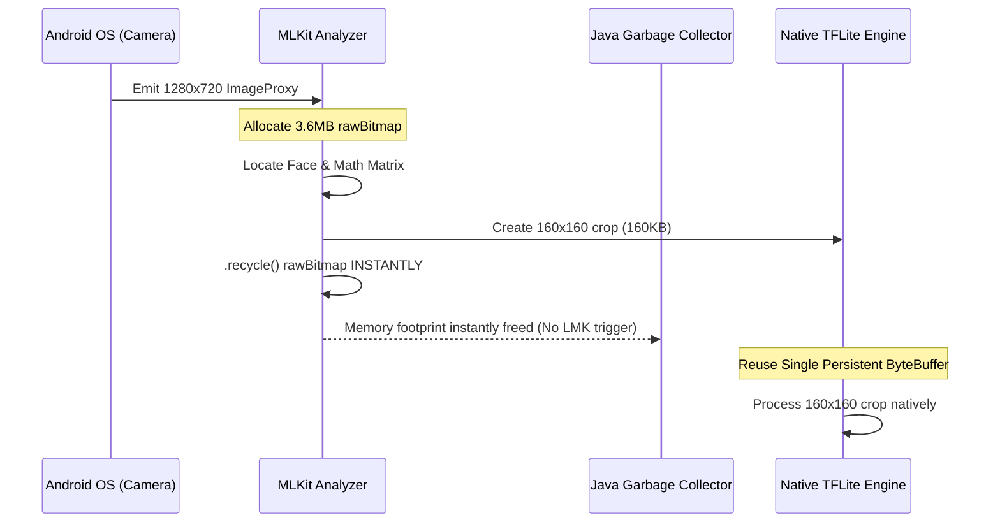

# Face Attendance System 🚀

A robust, offline-first Android application designed for seamless and automated attendance tracking using advanced Facial Recognition technology. 

This app leverages Google's ML Kit for lightning-fast face detection and a local TensorFlow Lite (FaceNet) model for highly accurate facial embeddings. All processing is executed strictly on-device, prioritizing privacy and ensuring zero dependency on cloud APIs.

---

## 🏗️ Detailed Architecture & System Design

To achieve real-time, 30 FPS facial tracking simultaneously with heavy mathematical neural network inference, the app is engineered using a highly optimized, decoupled two-lane architecture. 

### 1. The Two-Lane Asynchronous Pipeline
Instead of blocking the camera feed while waiting for the AI to recognize a face, the system splits the workload into two distinct lanes:

```mermaid
graph TD
    %% Main Camera Input
    Cam((CameraX Feed)) -->|30-60 FPS| Analyzer[MLKit ImageAnalyzer]
    
    subgraph UI Tracking Lane [Lane 1: UI & Tracking - Main Thread]
        Analyzer -->|Detect Faces| Tracker[MLKit Face Tracker]
        Tracker -->|Assigns Tracking ID| Overlay[UI Bounding Box]
        Overlay -->|Renders Instantly| Screen((Display))
    end
    
    subgraph Neural Inference Lane [Lane 2: AI Inference - Background Pool]
        Tracker -->|New/Unknown Face ID| Crop[Crop & Rotate 160x160 Bitmap]
        Crop -->|Add to Queue| Queue[(ConcurrentLinkedQueue)]
        Queue -->|Consume via Thread| TFLite[TensorFlow Lite FaceNet]
        TFLite -->|Calculate 192-Float Vector| Matching[Cosine Similarity Match]
        Matching -->|Query SQLite| Database[(Room Database)]
        Database -->|Return Name| Name[Update Bounding Box Label]
        Name -.-> Overlay
    end

    classDef lane1 fill:#e1f5fe,stroke:#03a9f4,stroke-width:2px;
    classDef lane2 fill:#fce4ec,stroke:#e91e63,stroke-width:2px;
    class UI Tracking Lane lane1
    class Neural Inference Lane lane2
```

* **The Tracking Lane (UI Thread / CameraX Analyzer):** 
  Runs at a solid **30-60 FPS**. Google's MLKit scans the camera feed, locates faces, and assigns them a temporary integer `Tracking ID`. It draws bounding boxes on the screen instantly, providing a buttery-smooth user experience without lag.
* **The Inference Lane (Background Thread Pool):** 
  Runs at **5-10 FPS**. When the tracking lane detects a new or unrecognized face, it mathematically crops and rotates a tiny 160x160 pixel segment of the face and places it into a `ConcurrentLinkedQueue`. A dedicated background thread continuously consumes this queue, feeding the faces through the heavy TensorFlow Lite model without ever stuttering the camera feed.

### 2. TensorFlow Lite (FaceNet) Engine
* **Face Embedding Calculation:** The `facenet.tflite` model ingests a 160x160x3 RGB face image and outputs a mathematical **192-dimensional float vector** (an embedding) that uniquely represents that face.
* **Hardware Acceleration & Fallbacks:** 
  * The app attempts to bind the Neural Network to the device's **GPU Delegate** for maximum throughput.
  * If the device drivers do not support GPU delegation, it falls back to a **4-Core CPU multithreaded** execution.
  * *Emulator Protection:* The app detects if it is running on an `x86/x86_64` architecture (e.g., Desktop Android Emulators). Due to a known `SIGSEGV` bug in TFLite's XNNPack delegate on x86, the app dynamically disables multithreading on emulators to prevent native C++ crashes, ensuring stability across both real ARM devices and virtual environments.

### 3. Memory & Resource Management (Anti-LMK)
Heavy camera processing can rapidly exhaust an Android device's Java Heap, triggering the OS's Low Memory Killer (LMK). To guarantee infinite uptime without memory leaks:



* **Manual Bitmap Lifecycle:** The 3.6 Megabyte raw camera frames from CameraX (`ImageProxy.toBitmap()`) are explicitly captured and `.recycle()`'d the exact microsecond the 160x160 face crop is extracted. This keeps the memory footprint perfectly flat and prevents the Garbage Collector from throttling the CPU.
* **Native Buffer Pooling:** The raw `ByteBuffer` and `int[]` structures required by TFLite are instantiated exactly once during app startup and reused infinitely for every frame, eliminating memory fragmentation and native memory exhaustion.

### 4. Smart Matching Algorithm & Motion Blur Recovery
* **Cosine Similarity:** The app uses a highly optimized Cosine Distance algorithm to compare a live face vector against all saved vectors in the local database. A threshold of `> 0.82` (configurable) registers a definitive match.
* **Rapid Retry Logic:** If a face is moving too fast and is blurred, the AI might classify it as "Unknown". The system implements a rapid 200-millisecond retry loop for unverified tracking IDs, continuously scanning the face until a sharp frame yields a positive match.

### 5. Local Data Storage & Privacy
* **Room Persistence Library (SQLite):** All member details, attendance logs, and mathematical face embeddings are stored in a local SQLite database accessed via AndroidX Room DAO interfaces.
* **No Cloud Storage:** No photos are sent to remote servers. Only the 192-float mathematical representations of the faces are stored locally.

---

## 🌟 Core Features

- **Real-time Live Recognition:** Scan and identify individuals instantly with 0 UI latency.
- **Group Photo Recognition:** Upload a group photo; the app will scan the image, locate multiple registered individuals simultaneously, and log attendance in bulk.
- **Robust Security PIN:** A secure PIN gate restricts access to the dashboard and attendance logs to authorized administrators only. The PIN flow is rigorously logged and validated on-device.
- **Smart Learning System:** The app registers up to 5 distinct face angles/lighting conditions per person to vastly increase dynamic recognition accuracy.
- **CSV Export:** Export full attendance logs directly to a `.csv` file for easy sharing via email or messaging apps.

---

## 🗂️ Project Structure

| Component | Description |
|-----------|-------------|
| **`RecognitionActivity`** | The core live-scanning engine. Manages the CameraX lifecycle, binds the MLKit Analyzer, and orchestrates the Two-Lane pipeline. |
| **`MainActivity`** | The administrative dashboard containing statistical fragments, attendance logs, and member lists via a `BottomNavigationView`. |
| **`LoginActivity`** | Secures the app interface and validates the Admin PIN before allowing access. Heavily instrumented with Logcat tracking (`LoginFlow`). |
| **`RegisterActivity`** | Handles onboarding of new members. Captures the initial face image and executes the TFLite inference to generate the baseline embedding. |
| **`GroupPhotoActivity`** | Executes static image multi-face detection and batch attendance logging. |
| **`db/` Package** | Contains the Room `AppDatabase`, `DAO` interfaces, and Entities (`MemberEntity`, `LogEntity`). |
| **`ml/Facenet`** | Auto-generated wrapper for the TensorFlow Lite model. |

---

## 🛠️ Setup & Installation

### Prerequisites
* **Android Studio** (Flamingo or newer)
* Physical Android Device (ARM64 recommended) or Emulator running **API Level 24+**

### Building from Source
1. Clone the repository:
   ```bash
   git clone https://github.com/abhishekkhade9137/Attendance-Android.git
   ```
2. Open the directory in **Android Studio**.
3. Allow Gradle to sync and download the required MLKit, TFLite, and CameraX dependencies.
4. Click **Run** (`Shift + F10`) to compile and deploy the APK.

---

## 🔐 Permissions Required

* **`CAMERA`**: For live face scanning and taking photos during registration.
* **`READ/WRITE_EXTERNAL_STORAGE`**: To select group photos and export CSV attendance logs.
